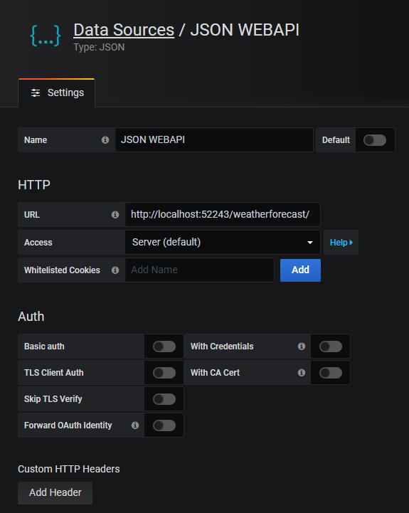
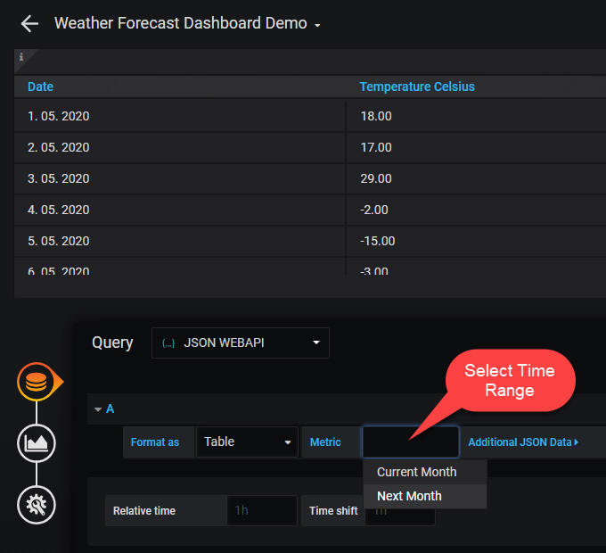
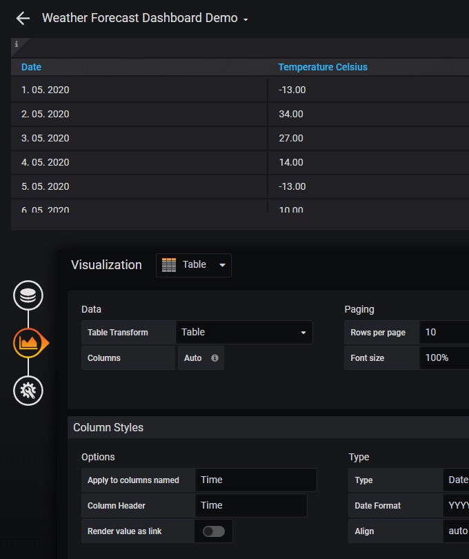
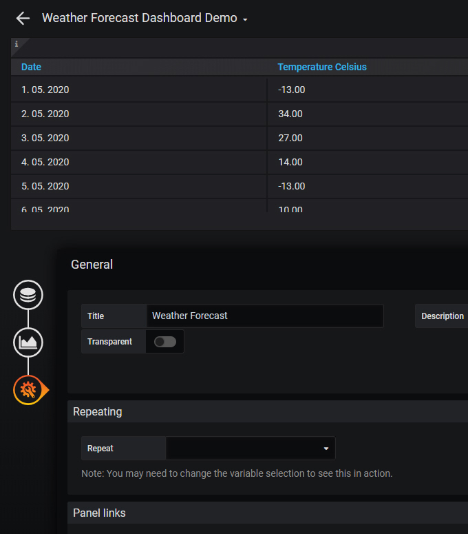
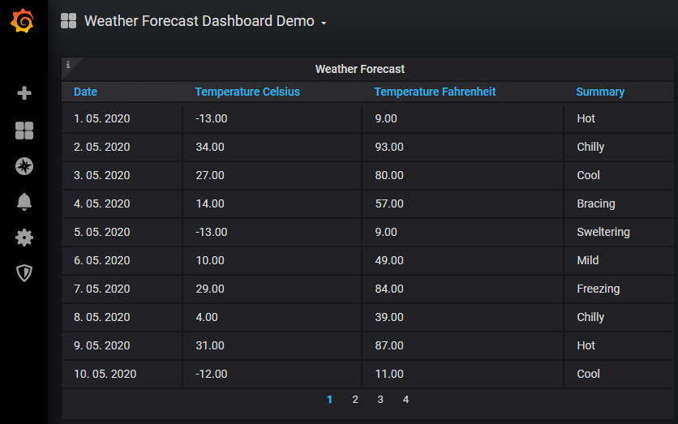

# Use JSON data in Grafana with ASP.NET Core WebApi Backend

Developing your own Dashboards nowadays make no sense. At all. That's why my colleague Matthias told me: "Hey, why don't you use Grafana?". And I did.

[Grafana](https://grafana.com/) describes itself as "*The open platform for beautiful analytics and monitoring*". Really? After a short time I fall in love with Grafana.
But with every great love comes also problems. Mine was how to convince Grafana to display non-time series JSON data in a Table Panel using classic ASP.NET Core WebApi Backend.
After some wrestling with her I've made this simple demo which demonstrates how to save your love and be happy. :)

## Graph Non-Time Series Data in a Table Panel
[Grafana](https://grafana.com/) can graph Time Series Data from many different types of data sources very well. But sometimes you just want to graph, simple non-time series data without timestamps, flat tables with regularly updated statistics or just simple lookup tables. And that was my intention.

## Let’s start!
For this sample we will create simple ASP.NET Core WebAPI backend with single REST WeatherForecast Controller. It's important that REST Controller implements predefined four REST Endpoints as it is described in [JSON Datasource – a generic backend datasource](https://grafana.com/grafana/plugins/simpod-json-datasource).
Those urls are:

**/** - should return 200 OK. Used for test connection on the datasource config page  
**/search** - should return available metrics when invoked  
**/query** - should return metrics based on input  
**/annotations** - should return annotations (not required and it is not implemented)

REST Endpoint **Query** receives request from Grafana like this:
```json
{
   "format":0,
   "intervalMs":500,
   "maxDataPoints":755,
   "range":{
      "from":"2020-05-15T13:04:43.952Z",
      "to":"2020-05-15T13:09:43.952Z"
   },
   "targets":[
      {
         "target":"1"
      }
   ]
}
```

Most important setting in Query Request is **"target"**. Following Enum explain available options.
```csharp
public enum SearchOptions
{
    CurrentMonth = 1,
    NextMonth = 2,
}
```

In our sample, according to **"target = 1"** shortened JSON response looks like this:
```json
{
   "type":"table",
   "columns":[
      {
         "text":"Date",
         "type":"date"
      },
      {
         "text":"Temperature Celsius",
         "type":"number"
      },
      {
         "text":"Temperature Fahrenheit",
         "type":"number"
      },
      {
         "text":"Summary",
         "type":"string"
      }
   ],
   "rows":[
      [
         "1. 05. 2020",
         29,
         84,
         "Sweltering"
      ],
      [
         "2. 05. 2020",
         22,
         71,
         "Warm"
      ],
      [
         "3. 05. 2020",
         -3,
         27,
         "Freezing"
      ],
      [
         "4. 05. 2020",
         -13,
         9,
         "Freezing"
      ],
      [
         "5. 05. 2020",
         19,
         66,
         "Chilly"
      ],
      [
         "30. 05. 2020",
         -13,
         9,
         "Chilly"
      ],
      [
         "31. 05. 2020",
         0,
         32,
         "Balmy"
      ]
   ]
}
```
And basically that's it! I won't go deeper in Backend because it is a really a "Hello Weather Forecast" sample.

## Installing Grafana
Before we start we have to install Grafana Server. Detailed instructions how to install Grafana on Windows you can find [here](https://grafana.com/docs/grafana/latest/installation/windows/). 
## Installing JSON Datasource Plugin
For using ASP.NET Core WebApi JSON responses as Datasource in Grafana we have to install [JSON Datasource Plugin](https://grafana.com/grafana/plugins/simpod-json-datasource). 

## Setup Datasource
When adding [JSON Datasource](https://grafana.com/grafana/plugins/simpod-json-datasource) we have to add our API endpoint to the URL field. That's where datasource will make requests to. Our API listening on url **http://localhost:52243**



## Setup Table Panel in Grafana
The Table Panel is very flexible, supporting both multiple modes for Time series as well as for Table, annotation and also raw JSON data. It also provides date formatting and value formatting and coloring options. To view Table Panels in action and test different configurations with sample data, check out the [Table Panel Showcase in the Grafana Playground](https://play.grafana.org/d/000000031/table-panel-showcase).





And result finally looks like this:


## Prerequisites
- [Visual Studio](https://www.visualstudio.com/vs/community) 2019 16.4.5 or greater
- [.NET Core SDK 3.1](https://dotnet.microsoft.com/download/dotnet-core/3.1)

## Tags & Technologies
- [ASP.NET Core 3.1](https://docs.microsoft.com/en-us/aspnet/?view=aspnetcore-3.1#pivot=core)
- [Grafana](https://grafana.com/)

Enjoy!

## Licence
Licenced under [MIT](http://opensource.org/licenses/mit-license.php).
Contact me on [LinkedIn](https://si.linkedin.com/in/matjazbravc).
